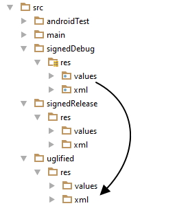

# Uglyfier for Android
##### Gradle script for downsizing graphical assets in development builds

### Problem
Normally, you wouldn't care how much data is consumed to transfer APK file when deploying it using remote ADB connection, however, if you use your personal mobile hotspot, it would be good to build possibly smallest APK to prevent all your mobile data from being consumed after just few hours of work.
### Solution
If, during development, small APK size matters more than high quality graphical assets, then it would be convenient to have a build variant that automatically shrinks all images found in project when generating an APK. That's exactly what Uglyfier does.

### How does it work?
Uglyfier is a gradle script that can be applied during build process. It uses specified build variant directory for its output, so the original files remain untouched. It scans whole project looking for image files (jpg and png) and depending on file type - reduces its quality (for jpg images) or used number of colors (for png) using [ImageMagick](http://www.imagemagick.org/). After saving all the images in a seperate build variant directory, build task proceeds and the downsized APK is generated.

Uglyfier automatically merges all files necessary to build project. You can specifiy source build variant to include its files during merge. For example, for following configuration:

```groovy
ext {
    destinationVariant = 'uglyfied'
    sourceVariant = 'signedDebug'
}
```
Uglyfier will merge following files:


### Results
We tested Uglyfier with our internal project that consists of may graphical assets and here are our results: 
Here are the results:
| Normal APK size | Uglyfied APK size | Size reduction |
|:-:|:-:|:-:|
| 22,688 KB | 5,486 KB | ~76 %|

### Prerequisites
* install [ImageMagick](http://www.imagemagick.org/),
* take a look at sample [build.gradle](sample/build.gradle) file.